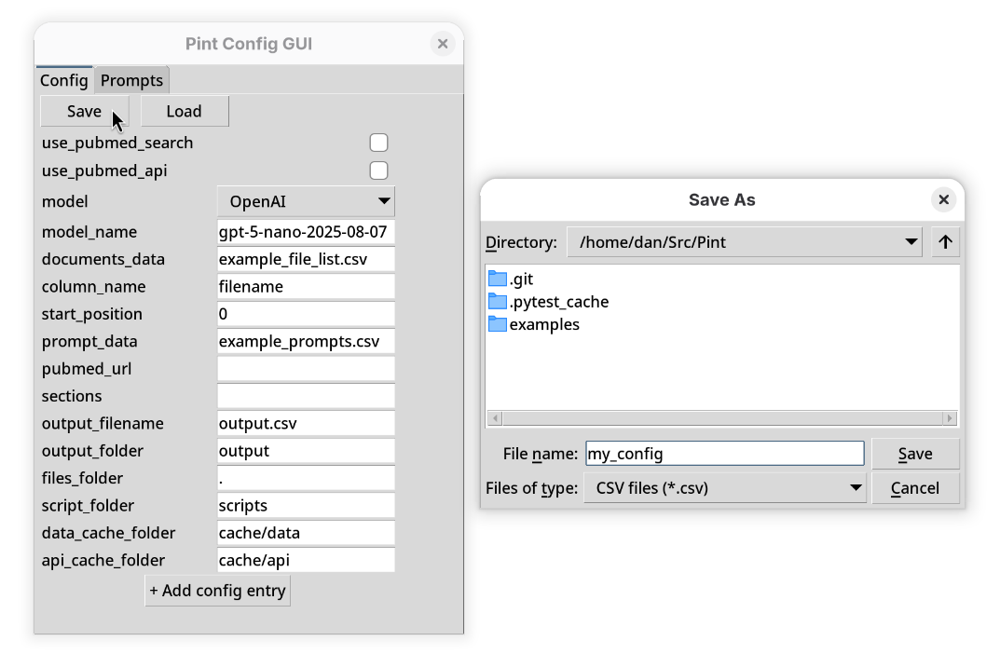
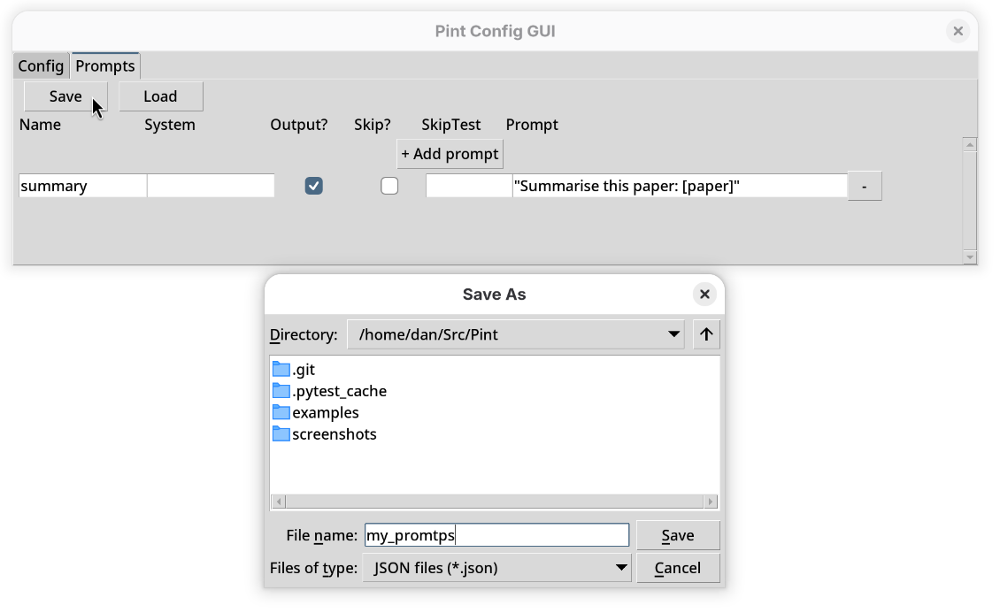

# Brief Usage Guide

PINT is a configurable pipeline for processing PubMed Central papers using Large Language Models (LLMs) such as OpenAI, Claude, or local models via scripts.

This guide walks you through **basic installation**, **configuration**, and **running PINT**, including use of the GUI.

This guide assumes access to a Linux environment/terminal and a Python 3.6 or later installation.

---

## 1. Installation

The only hard dependency is a Python version >= 3.6.

The following pip command installs pint, and the optional dependencies for reading PDF and XLSX files, and interfacing with the OpenAI and Anthropic APIs:
```bash
pip install pint_lib
```

To install without dependencies, select base:
```bash
pip install pint_lib[base]
```

Alternatively, to use with a specific python version, or keep dependencies isolated, suffices to use a python venv.
Shown is an example with python 3.11
```bash
python3.11 -m venv pint_env
source pint_env/bin/activate
pip install pint_lib
```

# 2. Basic Concepts

PINT is controlled entirely with configuration files (Excel, CSV, or JSON format), which define:
* Which LLM to use
* Where documents or PubMed IDs come from
* Where to find the prompts file
* Output location

The prompts file controls what prompts will be given to the LLM for each document.

These configuration and prompt files can be created and edited manually, via spreadsheet software, or using the provided config GUI.

The examples directory contains .xlsx files for various model providers.

# 3. Using the configuration GUI

Should .xlsx files prove to be inconvenient to work with, the config GUI is provided to generate .csv or .json files without having to manually edit them. It does not support .xlsx files.

To launch the GUI:
```bash
python -m pint_lib.config_gui
```

The GUI has two tabs:
* Config: for global settings (model, data paths, output)


* Prompts: for LLM prompt definitions



## Config tab

Key fields:
* use_pubmed_api: Enable fetching papers via the pubmed API
* model: One of OpenAI, Claude, External
* model_name: Model identifier (eg, gpt-5-nano)
* documents_data: Path to input file containing PMC IDs or filenames
* column_name: Column within the documents_data file holding document identifiers (default: filename)
* sections: Space separated list of paper sections to process quoted if multiple words
  * Example: `abstract introduction conclusion "future works"`
* output_filename/output_folder: Where outputs are written

## Prompts tab

Each row defines one prompt sent to the LLM.

The fields are as follow:
* Name: Identifier for the prompt
* System: Currently unused
* Output?: Whether to include the reply to this prompt in the output file
* Skip?: Whether a skip test should be used to skip current line
* SkipTest: function used to check the reply for skip condition
* Prompt: quoted list of space separated prompts
  * `[paper]` refers to the original document
  * `[reply]` refers to the reply of the previous prompt
  * Example: `"Summarise this paper: [paper]" "Does this summary mention bethoven? [reply]"`

# 4. File list

The configuration file refers to a documents_data file containing either the PMC IDs or the filenames of the files to pass to the LLM.

Here is an example file_list.csv, pointing to local pdf and txt files in the same directory:

```csv
filename,
attention_is_all_you_need.pdf,
alices_adventures_in_wonderland.pdf,
jabberwocky.txt,
```

If using the PubMed API, PMC IDs can be used instead:

```csv
pmid
36696458
33604307
27427762
23586929
22986493
```

The `filename` and `pmid` headers are defined in the configuration file as column_name.

# 5. Running Pint

The only command line needed is:
```bash
python -m pint_lib /path/to/the/configuration/file.extension
```
